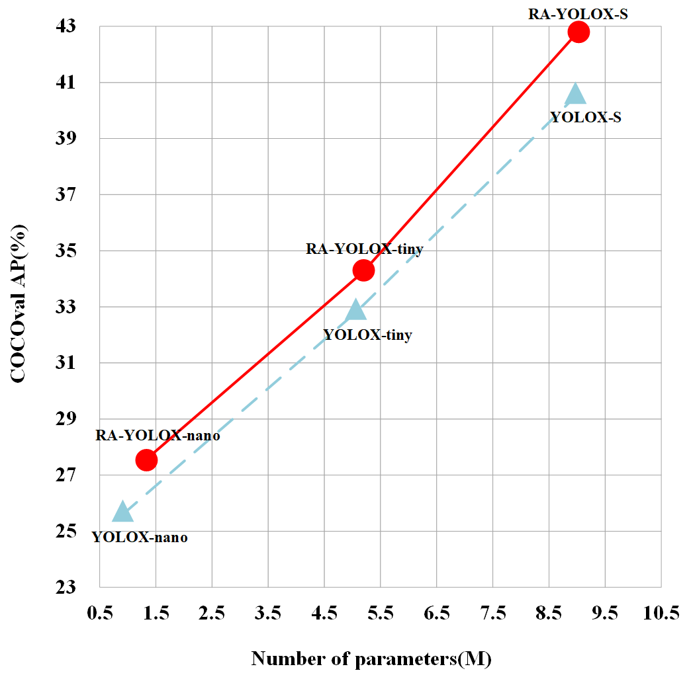

<div align="center"></div>

## Introduction
RA-YOLOX: a novel re-parameterization align decoupled head and a novel label assignment scheme based on YOLOX


####Models.

|Model |size |mAP<sup>val<br>0.5:0.95  |Params<br>(M) |FLOPs<br>(G)| weights |
| ------        |:---: | :---:    | :---:       |:---:     |:---:  |
|[RA-YOLOX-s](./exps/default/ra_yolox_s.py)    |640  |42.8     |9.0 | 27.2 | [github](https://github.com/hcmyhc/RA-YOLOX/releases/download/weight/ra_yolox_s.pth) |
|[RA-YOLOX-tiny](./exps/default/ra_yolox_tiny.py) |416  |34.3    |5.2 |6.8| [github](https://github.com/hcmyhc/RA-YOLOX/releases/download/weight/ra_yolox_tiny.pth) |
|[RA-YOLOX-nano](./exps/default/ra_yolox_nano.py)    |416  |27.5    |1.5| 2.4 | [github](https://github.com/hcmyhc/RA-YOLOX/releases/download/weight/ra_yolox_nano.pth) |


<details>
<summary>Reproduce our results on COCO</summary>

Step1. Prepare COCO dataset
```shell
cd <YOLOX_HOME>
ln -s /path/to/your/coco128 ./datasets/coco128
```

Step2. Reproduce our results on COCO by specifying -f:

```shell
python -m yolox.tools.train -f ../exps/example/custom/ra_yolox_s.py -d 1 -b 32 --fp16 -o [--cache]
                                                      ra_yolox-tiny
                                                      ra_yolox-nano
```
* -d: number of gpu devices
* -b: total batch size, the recommended number for -b is num-gpu * 8
* --fp16: mixed precision training
* --cache: caching imgs into RAM to accelarate training, which need large system RAM. 

  
</details>


<details>
<summary>Evaluation</summary>

We support batch testing for fast evaluation:

```shell
python -m yolox.tools.eval -f ../exps/example/custom/ra_yolox_s.py -c ra_yolox_s.pth -b 1 -d 1 --conf 0.001 [--fp16] [--fuse]
                                                     ra_yolox-tiny
                                                     ra_yolox-nano
```
* --fuse: fuse conv and bn
* -d: number of GPUs used for evaluation. DEFAULT: All GPUs available will be used.
* -b: total batch size across on all GPUs


</details>


